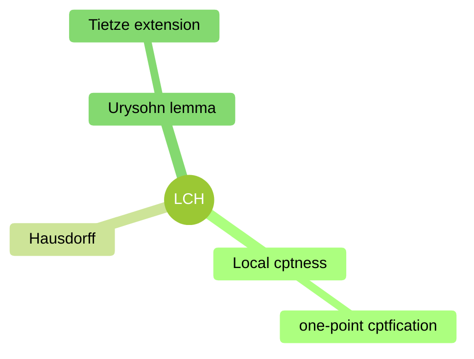

A *character* ${ \omega }$ on ${ A }$ is a nonzero linear map ${ \omega: A \to \mathbb{C} }$ for which

$$ \omega(ab)=\omega(a)\omega(b),\quad \omega(a^{\ast})=\overline{\omega(a)} $$

The *spectrum*, ${ \Omega(A) }$, of an algebra ${ A }$ is the set of all characters on ${ A }$ endowed with the topology of pointwise convergence on elements of ${ A }$.

*Gelfand transform* is the map ${ \tau: A \to C_{0}(\Omega(A)) }$ defined for all ${ a \in A }$

$$ \tau(a)(\omega) = \omega(a) $$

16:00 Local compateness
16:17 Alexandroff extension

17:00 uniform space
18:13 Urysohn's lemma
20:48 Separation and regularity