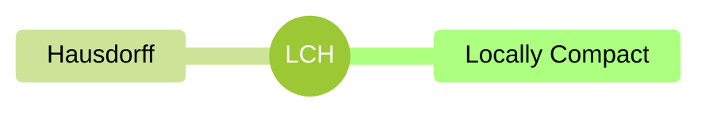

## 오늘 할일

- [x] Operator Algebras
- [x] Separation Axioms
- [x] Countability Axioms
- [x] LCH

## LCH

```mermaid
%%{init{'theme':'forest'}}%%
mindmap
root((LCH))
 Locally Compact
 Hausdorff
```

## 실제로 한것

- net

## 피드백

할일 아무것도 못함