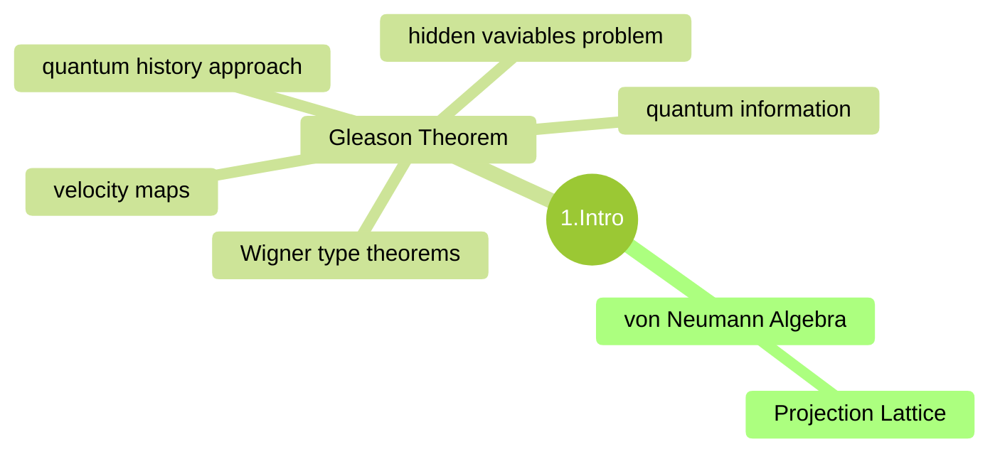

## Quantum Measure Theory

### Summary

#### Ch.1 Introduction

## Gleason's theorem and Its Applications

### Summary

#### Introduction

In 1936, G. Birkhoff and J. von Neumann published their historical paper "The logic of quantum mechanics", in which a quantum logic was suggested.

The aim of the present book is to give the reader a beauty of both Gleason's theorem and Gleason measures, and to indicate the many directions of their applications.

The Kolmogorov medel is very important, but it does not describe a situation that arises in quantum mechanics.

Born was the first to recognize the probability character of QM, which is indicated by the Heisenberg uncertatinty principle.

$$ \left( \Laplace \right) $$