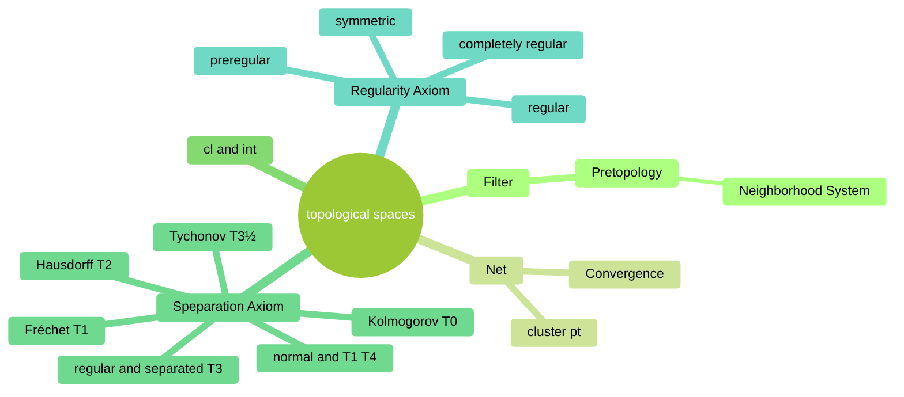

```mermaid
%%{init{'theme':'forest'}}%%
mindmap
root((topological spaces))
 Filter
  Pretopology
   Neighborhood System
 Net
  Convergence
  cluster pt
 cl and int
 Speparation Axiom
  Kolmogorov T0
  Fréchet T1
  Hausdorff T2
  regular and separated T3
  Tychonov T3½
  normal and T1 T4
 Regularity Axiom
  symmetric
  preregular
  regular
  completely regular
```
